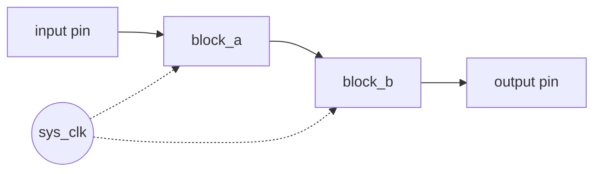

# Phase 2 — Architecture

> Decomposes the design from Phase 1 into a block diagram, a clock-domain
> map, and a top-level module list. Nothing in this phase is Verilog yet —
> the output is a drawing + a short description of how blocks connect.

## Source of truth
This phase refines:
- `docs/fpga/01_requirements.md` §Functional requirements
- `docs/fpga/01_requirements.md` §Reset + clocking

Any contradiction with Phase 1 means Phase 1 needs updating first. Do not
mask conflicts here.

## Block diagram

Render in Mermaid (preferred — version-control-friendly) or ASCII:

Edit the diagram until it shows:
- Every external pin (from Phase 1 I/O map)
- Every top-level block as a named node
- Every data path as a directional arrow labeled with signal name + width
  (e.g. `data[7:0]`)
- Every control/handshake path (valid/ready, ack/req)
- Every clock and reset fan-out (dashed lines are conventional)

## Clock domain map

| Domain name | Source | Frequency | Blocks driven | Notes |
|-------------|--------|-----------|---------------|-------|
| sys_clk     | {{e.g. external 50 MHz oscillator}} | 50 MHz | {{list}} | {{e.g. primary domain}} |
| serial_clk  | {{e.g. generated by baud_gen /16 oversampling}} | ~1.84 MHz | {{list}} | {{e.g. enable-pulse, not free-running}} |

If there is more than one domain, describe every crossing:

### CDC crossings
| From → To | Signal(s) | Synchronizer | Why safe |
|-----------|-----------|--------------|----------|
| {{dom_a → dom_b}} | {{signal list}} | {{2-FF / handshake / async FIFO / pulse sync}} | {{argument in one sentence}} |

No table entries = "design is single-clock-domain, no crossings" — state
that explicitly.

## Top-level module list

Name each block you'll implement. Naming convention: `<project>_<role>`
(e.g. `uart_baud_gen`, `uart_rx_fsm`). Each block becomes one Phase 3 spec.

| Module | Role | Inputs (summary) | Outputs (summary) | Clock domain |
|--------|------|------------------|-------------------|--------------|
| {{name}} | {{one-line role}} | {{a, b, c}} | {{x, y}} | {{sys_clk}} |

## Data flow walkthrough

Narrate a typical transaction end-to-end so the reader can sanity-check
the block diagram. Example:

1. External pin `rx` goes low (start bit)
2. `uart_baud_gen` detects the falling edge, starts a 16x-oversampled clock
3. `uart_rx_sampler` samples `rx` at the mid-point of each bit time
4. After 10 samples (start + 8 data + stop), `uart_rx_fsm` asserts
   `rx_valid` for 1 sys_clk cycle with `rx_data[7:0]`
5. Consumer on AXI-Stream side latches when `rx_valid && rx_ready`

## Reset distribution
- Which blocks see the reset directly
- Which blocks derive a local sub-reset (e.g. CDC resets)
- Reset sequencer if any (power-up ordering)

## Open issues carried forward to Phase 3
Things that aren't decided yet but must be by Phase 3 exit. Listing them
explicitly prevents silent drift.

- {{e.g. "FIFO depth — TBD in uart_rx_fifo spec"}}
- {{...}}

## Design alternatives considered and rejected
Optional but strongly encouraged. A single paragraph each.

- **Rejected: {{alternative}}** — {{why not, one sentence}}
- **Rejected: {{alternative}}** — {{why not}}

---

## Phase 2 exit gate

- [ ] Block diagram renders and covers every Phase 1 I/O pin
- [ ] Every arrow in the diagram has a signal name + width
- [ ] Clock-domain table complete; CDC crossings (if any) each have a safe
      strategy
- [ ] Top-level module list is concrete (no TBD names)
- [ ] Data-flow walkthrough tells a plausible story end-to-end
- [ ] Reset distribution strategy decided
- [ ] Open issues for Phase 3 explicitly listed
- [ ] User approval: reply **"approve phase 2"** or tick this box

Once all ticked, proceed to `docs/fpga/03_module_specs/` (one file per
top-level module).
