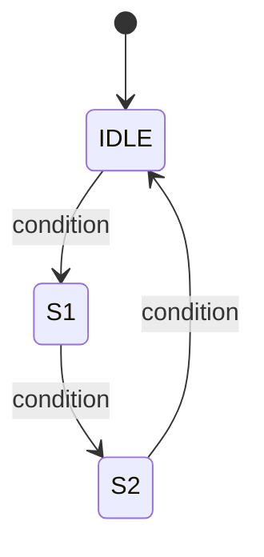

# Phase 3 — Module spec (per-module template)

> One file per top-level module listed in Phase 2. File name mirrors the
> module name: `docs/fpga/03_module_specs/<module_name>.md`.
> 
> This is the last phase before code. When this is approved, Phase 4 will
> feed this verbatim into `spec_to_rtl`.

## Source of truth
- `docs/fpga/02_architecture.md` §Top-level module list row for this module
- `docs/fpga/01_requirements.md` §External protocols for any protocol this
  module speaks

## Module identity
| Field | Value |
|-------|-------|
| Module name     | `{{module_name}}` |
| File            | `rtl/{{module_name}}.v` |
| Role            | {{one-line role from Phase 2}} |
| Clock domain    | {{sys_clk / serial_clk / ...}} |
| Reset           | {{e.g. active-low sync, shared with top-level rst_n}} |

## Port table
Every signal declared, including parameters. Widths must be concrete or
parameterized with a declared default.

### Parameters
| Name | Type | Default | Allowed range | Meaning |
|------|------|---------|---------------|---------|
| {{e.g. WIDTH}} | `int` | 8 | 1..32 | {{data-word width in bits}} |

### Ports
| Direction | Name | Width | Domain | Protocol | Meaning |
|-----------|------|-------|--------|----------|---------|
| input  | `clk`    | 1 | sys_clk | —           | {{clock}} |
| input  | `rst_n`  | 1 | sys_clk | —           | {{reset, active-low sync}} |
| input  | `{{sig}}` | {{W}} | {{domain}} | {{e.g. AXI-Stream valid/ready}} | {{meaning}} |
| output | `{{sig}}` | {{W}} | {{domain}} | {{...}} | {{...}} |

### Protocol / handshake semantics
For each handshake pair (valid/ready, ack/req, chip select + strobe, etc.):

- **`{{pair}}`**: {{rule — e.g. "valid must remain asserted until
  ready is high on the same cycle; data may change while valid is low"}}

If this module implements a well-known protocol (AXI, UART, SPI, I²C,
...), paste the relevant quote from the authoritative spec here. The
`datasheet-mcp.search_protocol` tool is the right way to pull this.

## Behavior specification

### Reset behavior
What every output drives and what every register holds when `rst_n == 0`.

- `{{output_a}}` = {{value at reset}}
- `{{output_b}}` = {{value at reset}}

### Normal operation
Natural-language paragraphs. Describe the **observable** behavior —
what does an observer outside the module see, cycle by cycle or event
by event. Do not describe internal registers yet (that's microarch below).

### Edge cases / error handling
Bullet every case. For each, say what the module does.

- {{e.g. "Start bit detected but stop bit not seen at expected time →
  frame_error asserted for 1 cycle, byte discarded, return to IDLE"}}
- {{...}}

## Microarchitecture

### FSM
If the module has a state machine:

Each state line: condition that enters, outputs Mealy-driven or
Moore-held, condition that exits. No silent states.

### Pipeline / dataflow
If combinational + registered:
- **Combinational next-state logic**: {{sketch the expression / function}}
- **Registered state**: {{what holds across cycles}}
- **Pipeline depth** (input pin to output pin): {{N cycles}}

### Resource budget (best-effort estimate)
| Resource | Estimate | Basis |
|----------|----------|-------|
| LUTs     | {{N}}    | {{e.g. FSM has 4 states + 8-bit shift reg}} |
| FFs      | {{N}}    | {{count registered signals}} |
| BRAMs    | {{0 or N}} | {{or "none"}} |
| DSPs     | {{0 or N}} | {{or "none"}} |

### Timing assumptions
- Max combinational delay between any two registers: {{< clock period}}
- Any multi-cycle paths: {{list or "none"}}
- Any false paths: {{list or "none"}}

## Verification hints (populates Phase 5)
Coverage points that Phase 5's `generate_testbench` should target.

- **Covpt-1**: {{e.g. "reset recovery — apply reset during active
  receive, verify return to IDLE"}}
- **Covpt-2**: {{e.g. "both saturation endpoints — up to max, down to 0"}}
- **Covpt-3**: {{e.g. "enable held low for ≥ 8 cycles, counter doesn't advance"}}

## Naming convention check
Cross-check against `analyze_naming_conventions_tool` output for this
project. If the project uses `clk` + `rst_n` (as scanned), new modules
must too. Record the scan result here once:

- Clock signal pattern: {{from scanner, e.g. "clk" confidence 1.0}}
- Reset signal pattern: {{from scanner, e.g. "rst_n" confidence 0.75}}

---

## Phase 3 exit gate (for this module)

- [ ] Port table complete, every signal has width + direction + domain
- [ ] Every handshake pair has an explicit rule
- [ ] Any referenced protocol cited with spec section
- [ ] Reset behavior enumerated for every output + registered state
- [ ] Normal operation description covers the full lifecycle
- [ ] Every edge case enumerated (not "etc.")
- [ ] FSM (if any) drawn with no silent states
- [ ] Resource budget estimated
- [ ] Timing assumptions declared (multi-cycle / false paths explicit)
- [ ] At least 3 coverage points for Phase 5
- [ ] Naming aligns with project convention
- [ ] User approval: reply **"approve spec for {{module_name}}"** or tick

Phase 3 overall is complete when **every** module listed in Phase 2 has
an approved spec under `docs/fpga/03_module_specs/`.
