# Phase 2 — Architecture

> Populated 2026-05-05 by the `fpga_flow` skill.
> **Status: approved for phase 3.**

## Source of truth
Refines:
- `01_requirements.md` §Functional requirements FR-2 (oversampling),
  FR-3 (mid-bit sampling), FR-4..7 (FSM-level behavior)
- `01_requirements.md` §Reset + clocking (single-domain sync rst_n)

## Block diagram

```
                sys_clk (50 MHz)
                   │
                   ▼
  ┌──────────────────────────────────────────────────┐
  │                                                  │
  │   ┌───────────────────┐   tick                   │
  │   │  uart_baud_gen    │─────────────┐            │
  │   │                   │             │            │
  │   │  DIV = 271        │             │            │
  │   │  (50M/115200/16)  │             ▼            │
  │   └───────────────────┘   ┌───────────────────┐  │
  │                            │     uart_rx      │  │
  │    UART_RX ────sync_2ff───▶│                  │──┼──▶ RX_DATA[7:0]
  │                            │  IDLE/START/     │  │
  │                            │  DATA[0..7]/     │──┼──▶ RX_VALID
  │                            │  STOP            │──┼──▶ RX_FRAME_ERROR
  │                            │                  │◀─┼── RX_READY
  │                            │  shift reg[7:0]  │  │
  │                            └───────────────────┘  │
  │                                                  │
  │   RST_N ───────────────────────────────────────┐ │
  │                                                │ │
  │   (distributed to both blocks as rst_n)───────┘ │
  └──────────────────────────────────────────────────┘
```

(Mermaid equivalent — renders in Claude Code / IDE preview:)

```mermaid
flowchart LR
    CLK((sys_clk<br>50 MHz)) -.-> BG[uart_baud_gen<br>DIV=271]
    CLK -.-> RX[uart_rx<br>FSM + shift reg]
    BG -- tick --> RX
    RXPIN[UART_RX pin] --> SYNC[2-FF sync]
    SYNC --> RX
    RX --> DATA[RX_DATA &#91;7:0&#93;]
    RX --> VALID[RX_VALID]
    RX --> ERR[RX_FRAME_ERROR]
    READY[RX_READY] --> RX
    RSTN[RST_N] -.-> BG
    RSTN -.-> RX
```



## Clock domain map

| Domain  | Source               | Frequency | Blocks driven           | Notes |
|---------|----------------------|-----------|-------------------------|-------|
| sys_clk | external 50 MHz osc  | 50 MHz    | uart_baud_gen, uart_rx  | single domain |

### CDC crossings
None within the digital design. The only asynchronous signal is the
external `UART_RX` pin, synchronized via a 2-flop synchronizer that is
part of the `uart_rx` module (not a separate block — keeps module count
down). This is standard practice for a single-bit async input; no
handshake needed because UART RX line transitions are inherently slow
relative to sys_clk (each bit is ~434 sys_clk cycles wide at 115200).

## Top-level module list

| Module          | Role                                            | Inputs (summary)                  | Outputs (summary)                     | Clock  |
|-----------------|-------------------------------------------------|-----------------------------------|---------------------------------------|--------|
| `uart_baud_gen` | Generate 16× oversampling tick (1-cycle pulse)  | clk, rst_n                        | tick                                   | sys_clk |
| `uart_rx`       | Start detect, bit-center sample, FSM, shift reg | clk, rst_n, tick, rx_in, rx_ready | rx_data[7:0], rx_valid, rx_frame_error | sys_clk |

A `uart_rx_top` integration wrapper is optional — a single project
top-level file that instantiates both modules + pin assignments. For
this demo we treat the two modules as the deliverable; the user can
wrap them in their own top-level.

## Data flow walkthrough

A typical byte reception, cycle by cycle:

1. **Idle**: `UART_RX` is high, `uart_rx` FSM is in IDLE, `uart_baud_gen`
   is freely running but its tick is irrelevant when FSM = IDLE.
2. **Start bit detect**: `UART_RX` falls low. The synchronized input
   goes low 2 sys_clks later. FSM sees the low in IDLE state and
   transitions to START. It arms an internal tick counter at 0.
3. **Mid-start sample**: After 8 baud ticks (mid of start bit, ~4.3 µs
   in), FSM confirms `rx_in_sync == 0`. If not, framing broke → return
   to IDLE. If confirmed, proceed to DATA0, reset tick counter.
4. **Data bit capture**: FSM transitions through DATA0..DATA7. In each
   state, it waits for 16 ticks, then samples `rx_in_sync` and shifts
   it into the LSB of the 8-bit shift register.
5. **Stop bit check**: FSM enters STOP. Waits 16 ticks. Samples
   `rx_in_sync`. If high → assert `rx_valid` + drive `rx_data` from
   shift register for 1 sys_clk. If low → assert `rx_frame_error` for
   1 sys_clk.
6. **Return to IDLE**: FSM returns to IDLE, immediately ready to detect
   the next start bit.

Total: 10 bit times × 16 ticks/bit = 160 ticks per byte = 86.8 µs at
115200. Meets NF-3 (< 87 µs from stop bit to RX_VALID — actually
measured from start bit, but end-to-end is what matters).

## Reset distribution

- `rst_n` fans out to both modules directly
- No local sub-resets (single clock domain makes this simple)
- Reset sequencer: none required — external pushbutton / POR
  (debouncing is out of scope, assumed to have been handled externally)

## Open issues carried forward to Phase 3

- **uart_baud_gen DIV constant**: exactly 50_000_000 / 115200 / 16 =
  27.127... → round to 27. Actual baud: 50e6/16/27 = 115740.7, which is
  +0.47% from 115200 — within the ±2% NF-2 target. Confirmed, no
  further open item.
- **Synchronizer depth**: 2 flops is standard. Phase 3 will pick this
  as a fixed parameter.
- **FSM encoding**: binary vs one-hot — defer to Phase 3, Yosys can be
  told to pick.

## Design alternatives considered and rejected

- **Rejected: merge uart_baud_gen into uart_rx as a single block.** —
  Keeping baud gen as its own module makes the oversampling rate a
  parameter someone can tune, and lets the same baud_gen be shared by
  an eventual TX module. Clean separation is worth the +1 module cost
  for a reference design.
- **Rejected: non-oversampling approach (sample at exact bit
  boundaries).** — 16× oversampling is the textbook solution;
  tolerates clock skew between TX and RX far better. Zero reason to
  save the 4 bits of counter this would cost.
- **Rejected: deep FIFO on the output side.** — Single-byte register
  is enough for the demo. A FIFO would add complexity without
  demonstrating anything the flow doesn't already cover.

---

## Phase 2 exit gate

- [x] Block diagram renders and covers every Phase 1 I/O pin
- [x] Every arrow has signal name + width (implicit for scalars)
- [x] Clock-domain table complete; single domain, no CDC (with rationale)
- [x] Top-level module list is concrete (uart_baud_gen, uart_rx)
- [x] Data-flow walkthrough tells plausible end-to-end story
- [x] Reset distribution strategy decided
- [x] Open issues for Phase 3 resolved or deferred with rationale
- [x] **User approval: approved phase 2 (demo auto-approval)**

Proceed to `03_module_specs/`.
