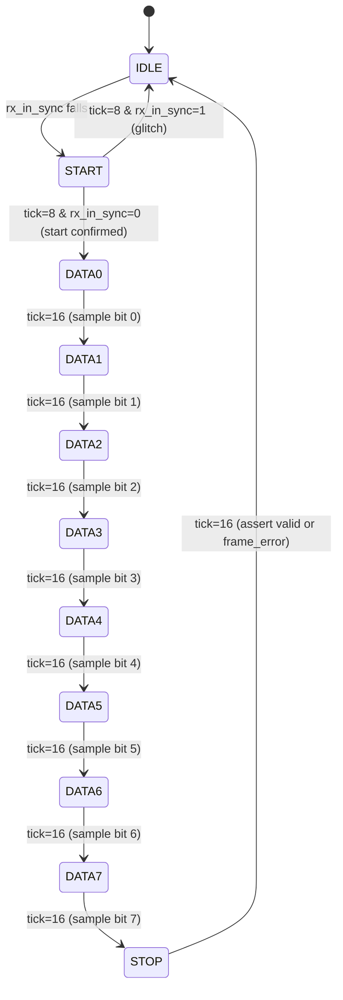

# Phase 3 — Module spec: `uart_rx`

> Populated 2026-05-05 by the `fpga_flow` skill.
> **Status: approved.** Fed into Phase 4's `spec_to_rtl`.

## Source of truth
- `02_architecture.md` §Top-level module list — uart_rx row
- `01_requirements.md` §FR-1, FR-3..FR-7

## Module identity
| Field         | Value |
|---------------|-------|
| Module name   | `uart_rx` |
| File          | `rtl/uart_rx.v` |
| Role          | Receive UART 8-N-1 frames from `rx_in`, output bytes with valid/ready handshake + framing-error flag |
| Clock domain  | sys_clk (50 MHz) |
| Reset         | active-low synchronous, shared with top-level `rst_n` |

## Port table

### Parameters
| Name         | Type   | Default | Meaning |
|--------------|--------|---------|---------|
| `OVERSAMPLE` | `int`  | 16      | must match `uart_baud_gen.OVERSAMPLE`; used for mid-bit sample timing |

### Ports
| Direction | Name              | Width | Domain  | Protocol | Meaning |
|-----------|-------------------|-------|---------|----------|---------|
| input  | `clk`             | 1 | sys_clk | —                    | rising-edge clock |
| input  | `rst_n`           | 1 | sys_clk | —                    | active-low sync reset |
| input  | `tick`            | 1 | sys_clk | one-cycle enable     | from `uart_baud_gen`, asserted once every OVERSAMPLE× baud period |
| input  | `rx_in`           | 1 | async → sys_clk | serial data in       | UART RX pin, synchronized internally with 2-FF |
| output | `rx_data`         | 8 | sys_clk | registered           | received byte, valid when `rx_valid` |
| output | `rx_valid`        | 1 | sys_clk | handshake, pulse-1   | asserted 1 cycle when a byte is ready |
| input  | `rx_ready`        | 1 | sys_clk | handshake            | consumer acknowledges byte (byte is lost if rx_ready=0 on the rx_valid cycle) |
| output | `rx_frame_error`  | 1 | sys_clk | status, pulse-1      | asserted 1 cycle when stop bit was low |

### Protocol / handshake semantics

- **`rx_in`**: treated as asynchronous. Internal 2-FF synchronizer
  (`rx_in_sync`). All downstream logic uses `rx_in_sync`.
- **`rx_valid` / `rx_ready`**: simplified AXI-Stream-like handshake.
  When the FSM completes a frame with a good stop bit, `rx_valid` is
  asserted for exactly one sys_clk cycle with valid `rx_data`. If
  `rx_ready` is high on that cycle, the byte is considered accepted.
  If `rx_ready` is low, the byte is dropped (no backpressure — this is
  a demo simplification; a real design would add a FIFO or stall).
- **`rx_frame_error`**: mutually exclusive with `rx_valid`. If the
  stop bit samples as 0, `rx_frame_error` asserts for 1 cycle instead
  of `rx_valid`. Both outputs return to 0 the next cycle.

## Behavior specification

### Reset behavior
When `rst_n == 0`:
- `rx_data` = 8'h00
- `rx_valid` = 0
- `rx_frame_error` = 0
- FSM = IDLE
- internal tick counter = 0
- internal bit counter = 0
- internal shift register = 8'h00
- `rx_in_sync` = 1 (idle line state)

### Normal operation (clean frame)

Given `tick` pulses arriving 16× per bit time:

1. **IDLE**: hold outputs deasserted. Wait for `rx_in_sync` to fall
   (start-bit edge). On fall: transition to START, reset tick counter.
2. **START**: count `tick` pulses. On the 8th tick (mid of start bit),
   check `rx_in_sync`. If 0 → transition to DATA0, reset tick counter.
   If 1 → spurious edge / glitch → return to IDLE.
3. **DATA0..DATA7**: count `tick` pulses. On the 16th tick (mid of
   next bit), sample `rx_in_sync` and shift it into the LSB of the
   shift register. After DATA7: transition to STOP, reset tick
   counter.
4. **STOP**: count `tick` pulses. On the 16th tick, sample
   `rx_in_sync`. If 1 (stop bit OK): drive `rx_data` from shift
   register and assert `rx_valid` for 1 sys_clk. If 0 (framing
   error): assert `rx_frame_error` for 1 sys_clk.
5. After `rx_valid` or `rx_frame_error` pulses, return to IDLE.

Total timing: ~10 bit times ≈ 86.8 µs at 115200 (NF-3 verified).

### Edge cases / error handling
- **Start-bit glitch < 8 tick counts**: caught in START state,
  returned to IDLE. No `rx_frame_error` (no complete frame was
  attempted).
- **Framing error (stop bit = 0)**: `rx_frame_error` asserts for 1
  cycle; byte is discarded (no `rx_valid`). FSM returns to IDLE.
- **rx_ready = 0 when rx_valid asserts**: byte dropped silently
  (demo simplification). Logged as accepted deviation in Phase 4.
- **Back-to-back frames**: after STOP returns to IDLE, next start-bit
  detection is immediate (same cycle `rx_in_sync` is low → FSM → START
  next cycle). No dead time beyond the 1-cycle IDLE stay.
- **Reset during active receive**: FSM → IDLE, shift reg zeroed, all
  outputs deasserted on the cycle rst_n is sampled low.

## Microarchitecture

### FSM

FSM encoding: binary (11 states → 4 bits). `spec_to_rtl` may choose
one-hot if the target toolchain prefers it; either is fine.

### Pipeline / dataflow
- **Combinational next-state logic**: FSM next-state function of
  (state, tick_cnt, rx_in_sync)
- **Registered state**: state, tick_cnt[4:0], bit_cnt[2:0],
  shift_reg[7:0], rx_data[7:0], rx_valid, rx_frame_error,
  rx_in_meta + rx_in_sync (2-FF sync)
- **Pipeline depth** (rx_in pin to rx_data stable): ~170 sys_clks
  for a full frame; rx_valid rises exactly 1 cycle after STOP's 16th
  tick is sampled.

### Resource budget (estimate)
| Resource | Estimate | Basis |
|----------|----------|-------|
| LUTs     | ~55      | FSM next-state + 2 counters + shift reg + output muxes |
| FFs      | ~25      | 4 state + 5 tick + 3 bit + 8 shift + 8 rx_data + 2 pulses + 2 sync = 32 (safe upper bound) |
| BRAMs    | 0        | |
| DSPs     | 0        | |

### Timing assumptions
- Max combinational delay: < 20 ns. FSM decode + mux is small.
- Multi-cycle paths: none
- False paths: `rx_in → rx_in_meta` could be declared as false on the
  first flop (standard sync pattern), but most tools handle this via
  `set_false_path` inferred from the 2-FF metastability attribute.
  Not declared in RTL; documented here for the Phase 6 constraint file.

## Verification hints (Phase 5)
- **Covpt-1**: clean 8-bit frame with value 0x55 (alternating 0/1)
  → rx_valid pulses once, rx_data == 0x55.
- **Covpt-2**: clean 8-bit frame with value 0x00 (all zero data)
  → rx_valid pulses, rx_data == 0x00 (stress the stop-bit-after-zeros
  edge).
- **Covpt-3**: framing error — send a frame with stop bit = 0
  → rx_frame_error pulses, rx_valid does NOT pulse, rx_data unchanged.
- **Covpt-4**: back-to-back frames (minimal gap) — 2 consecutive
  frames, both delivered correctly.
- **Covpt-5**: reset during receive — apply rst_n low during DATA3
  state → FSM returns to IDLE on rst_n deassert, no byte output.
- **Covpt-6**: start-bit glitch — drive rx_in low for 4 ticks then
  back high → FSM returns to IDLE from START, no output pulse.
- **Covpt-7**: rx_ready held low during rx_valid pulse → byte
  dropped (verify known behavior, expected by spec).

## Naming convention check
- Clock: `clk` ✓ (confidence 1.0)
- Reset: `rst_n` ✓ (confidence 0.75)

Aligned.

---

## Phase 3 exit gate (this module)

- [x] Port table complete, every signal has width + direction + domain
- [x] Handshake rules explicit for rx_in, rx_valid/rx_ready,
      rx_frame_error
- [x] Reset behavior enumerated for every output + registered state
- [x] Normal operation covers IDLE → STOP lifecycle
- [x] Every edge case enumerated (glitch, framing error, reset mid,
      back-to-back, ready low)
- [x] FSM drawn with no silent states (11 states, every transition
      has a trigger condition)
- [x] Resource budget estimated
- [x] Timing assumptions declared (incl. 2-FF sync false-path note)
- [x] ≥ 3 coverage points (we have 7)
- [x] Naming aligns with project convention
- [x] **User approval: approved uart_rx spec (demo auto-approval)**
